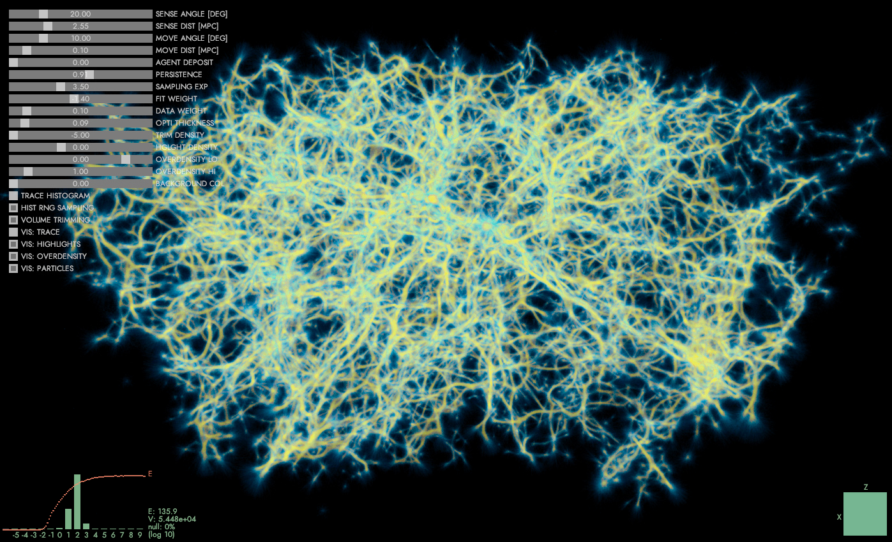

# Polyphorm
*Polyphorm* is an interactive tool to analyze intergalactic gas and dark matter filaments (together known as 'Cosmic web') using the **Monte Carlo Physarum Machine** (MCPM) algorithm inspired by the foraging behavior of [Physarum polycephalum](https://en.wikipedia.org/wiki/Physarum_polycephalum) 'slime mold'.

*Polyphorm* has two main components: simulation and visualization.

The simulation component implements the [MCPM algorithm](https://cgg.mff.cuni.cz/~oskar/research.html#BurchettElek2020) to reconstruct an optimal transport network given a set of point data in 3D space. Such data can represent the distribution of galaxies or dark matter halos, typically on the scales of 100s of megaparsecs. MCPM uses a swarm of millions of particle-like agents to explore the simulation domain. These agents are attracted to each other, as well as the input data. After a number of iterations, the simulation reaches a dynamic equilibrium: the agents still move, but the totality of their trajectories is stable. The output of the algorithm at this stage is a 3D spatio-temporal density of the agents which we interpret as an estimate of the Cosmic web.

The visualization component facilitates analysis tasks of the estimated network. Thanks to the interactive nature of *Polyphorm* we can observe changes of the estimate in response to changing MCPM parameters. The main concern is whether the reconstruction fits the input data (i.e. all the input points are contained in it) as well as the plausibility of the obtained filamentary structures.

## Requirements
- Windows OS (tested on 10)
- Decent GPU, especially in terms of available VRAM (tested on NVIDIA TitanX 12 GB, minimum recommendation 4 GB)
- Visual Studio 2017 or 2019 (might be adapted to older versions)
- DirectX 11 installed on system
- DirectXTex library (repo and cofiguration: https://github.com/Microsoft/DirectXTex)

## Build Instructions
- Clone the repo
- Setup build tool (**./builder/**)
  - Make sure that path in **build.bat** points to existing **vcvarsall.bat** (depends on your VS installation version)
  - Run **setup.bat** to add builder into PATH (or set it manually to point to **./builder/bin/**)
- Check that **polyphorm.build** points to the correct directories (especially wrt. the DirectXTex library installation)
- Run `build run polyphorm.build --release` from the root (the build process will produce a short log - if not then something went wrong, make sure that all the paths are configured correctly and the required dependencies exist)

## Quick Manual
The software is launched simply by running **./bin/polyphorm.exe**. The **./bin/config.polyp** file holds most of the settings. The supplied sample dataset is a corpus of 37.6k galaxies from the SDSS catalog described in *Burchett et al. 2020: Mapping the Dark Threads of the Cosmic Web*. The dataset can be changed in the preamble of **main.cpp** (will be freely configurable later).

### Controls
Most of *Polyphorm*'s controls are a part of the UI, including changing the visualization modality and its parameters. The rest is mapped as follows:
- Left/right/middle mouse: rotate/pan/zoom camera
- F1/Esc: toggle/terminate UI
- F2/F3: reset/toggle the simulation
- F4: autorotating camera
- F5/F6: export agent/field data (to ./bin/export/)
- F7/'1': activate continuous/single screen capture (stored in ./bin/capture)
- F8: flush the trace data (but maintain agents' and simulation state)
- F9/F10: save/load current visualization state (camera + visual settings)

### Simulation
Immediately upon launching, *Polyphorm* starts fitting to the input data. The state of the fitting is captured in the red energy plot: the higher the energy value, the more are the simulation agents aligned with the input data. The spatio-temporal agent density is captured in the green histogram: healthy fits typically have a bell-shaped log-density distribution with a slight positive skew.

### Visualization
*Polyphorm* supports multiple visualization modalities to facilitate the analysis of the reconstructed Cosmic web estimate.

- **Particle mode** directly renders the input data (red) and MCPM agents (white) as discrete points.

- **Trace mode** uses direct volume rendering to visualize the spatio-temporal agent density field. The density is mapped to a configurable color palette and rendered using the emission-absorption volumetric medium model.

- **Overdensity mode** segments the trace field into three configurable intervals (low/medium/high density) and renders each with a different color (blue/green/red) to better understand the spatial distribution of the agents.

- **Highlights mode** renders the trace (purple) superimposed on the deposit - the volumetric 'footprint' of the input data (bright yellow). This modality additionally supports the highlighting of a selected density band.

- **Trimming function** allows axis aligned slicing of the 3D space to allow for more detailed/uncluttered inspection. This works for every visualization modality.

## Team
*Polyphorm* would not happen without the following humans:
- [Oskar Elek](https://cgg.mff.cuni.cz/~oskar) - corresponding author, simulation and visualization
- [Joe Burchett](http://www.joeburchett.com/) - astronomical expertise and data
- [Angus Forbes](https://creativecoding.soe.ucsc.edu/angus/) - funding and guidance
- [Jan Ivanecky](http://janivanecky.com/) - initial prototype and technical support

As well as one protista:
- [Physarum polycephalum](https://en.wikipedia.org/wiki/Physarum_polycephalum) - spatial navigation and foraging

Additional thanks belong to Sage Jenson, Jeff Jones, J. Xavier Prochaska, Daisuke Nagai (all humans).

## Publications
*Polyphorm* has been instrumental in the following scientific results.
- [Revealing the Dark Threads of the Cosmic Web](https://cgg.mff.cuni.cz/~oskar/research.html#BurchettElek2020) (Astrophysical Journal Letters, March 2020)
- [Disentangling the Cosmic Web Towards FRB 190608](https://arxiv.org/abs/2005.13157v1) (ArXiv, May 2020)
