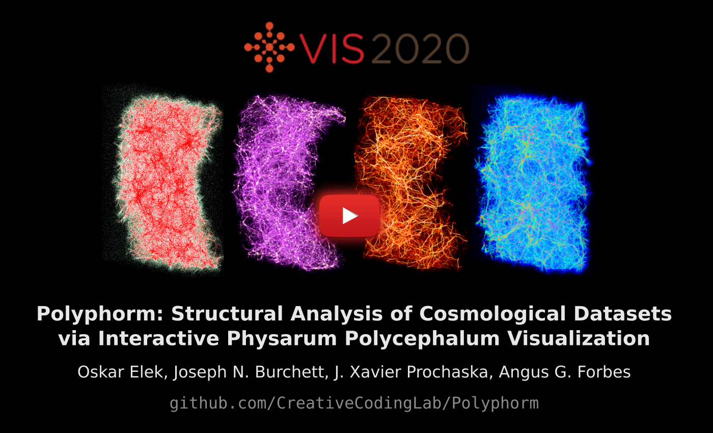
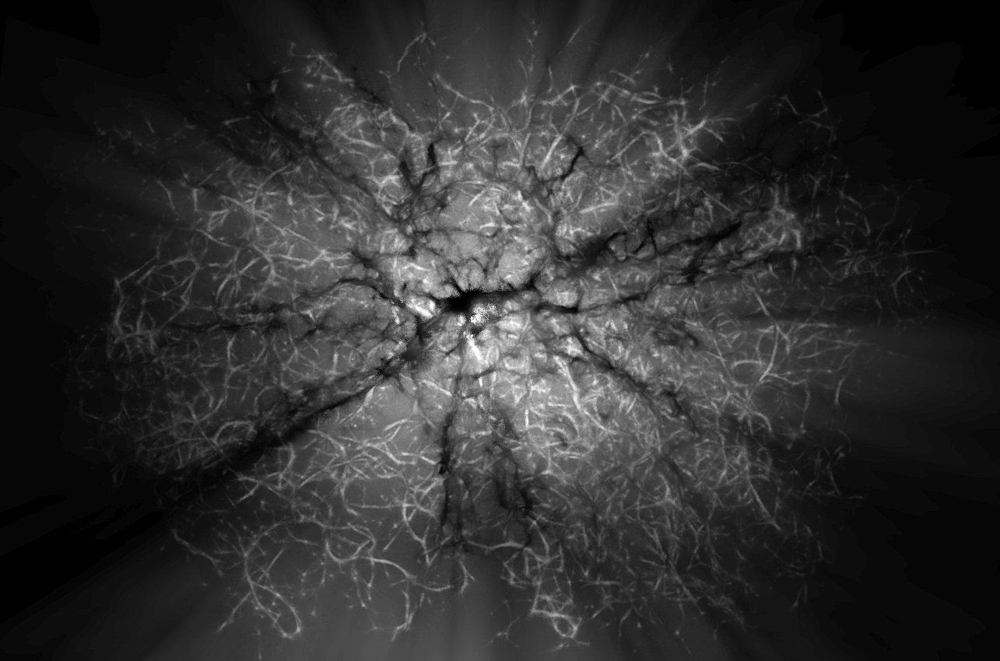

# Polyphorm
*Polyphorm* is an interactive tool to analyze intergalactic gas and dark matter filaments (together known as 'Cosmic web') using the **Monte Carlo Physarum Machine** (MCPM) algorithm inspired by the foraging behavior of [Physarum polycephalum](https://en.wikipedia.org/wiki/Physarum_polycephalum) 'slime mold'.

*Polyphorm* has two tightly coupled main components: simulation and visualization.

**The simulation component** implements the [MCPM algorithm](https://cgg.mff.cuni.cz/~oskar/research.html#BurchettElek2020) to reconstruct an optimal transport network given a set of point data in 3D space. Such data can represent the distribution of galaxies or dark matter halos, typically on the scales of 100s of megaparsecs. MCPM uses a swarm of millions of particle-like agents to explore the simulation domain. These agents are attracted to each other, as well as the input data. After a number of iterations, the simulation reaches a dynamic equilibrium: the agents still move, but the totality of their trajectories is stable. The output of the algorithm at this stage is a 3D spatio-temporal density of the agents which we interpret as an estimate of the Cosmic web.

**The visualization component** facilitates analysis tasks of the estimated network. Thanks to the interactive nature of *Polyphorm* we can observe changes of the estimate in response to changing MCPM parameters. The main concern is whether the reconstruction fits the input data (i.e. all the input points are contained in it) as well as the plausibility of the obtained filamentary structures.

You can see *Polyphorm* in action in the **following video**. A selection of more videos demonstrating the software in different reconstruction and visualization scenarios is available [here](https://docs.google.com/document/d/1V858oljGT1gu-gTVMAZOqtZjFEtK_rULsCg_VDeXulk/edit?usp=sharing).

## System Requirements
- Decent GPU, especially in terms of available VRAM (**minimum 2GB, recommended 4GB**; tested on NVIDIA TitanX 12GB, RTX Titan 24GB, RTX 2070 Mobile 8GB, AMD Radeon RX5500 8GB)
- Windows OS (tested on 10)
- DirectX 11 installed on system
- [Visual Studio](https://visualstudio.microsoft.com/downloads) (tested on 2017 or 2019, probably might be adapted to older versions)
- [Visual Studio Build Tools](https://devblogs.microsoft.com/cppblog/introducing-the-visual-studio-build-tools/) installed (can simply be selected during the VS install process, or alternatively, installed separately)

## Installation Instructions
- Clone the [DirectXTex repository](https://github.com/Microsoft/DirectXTex)
- Build the DirectXTex library
  - Open one of the premade **.sln** files (corresponding to your platform), select the 'Release' build configuration, and build the solution
  - If the build doesn't go through, make sure you have [VS Build Tools](https://devblogs.microsoft.com/cppblog/introducing-the-visual-studio-build-tools/) installed (v141 for VS 2017, and v142 for VS 2019)
- Clone the *Polyphorm* repository
- Setup the bundled build tool (**./builder/**)
  - Make sure that the paths in **build.bat** point to existing **vcvarsall.bat** (depends on your VS installation version, usually somewhere in Program Files)
  - Add the absolute path to **./builder/bin/** into the PATH environment variable
- Check that **polyphorm.build** points to the correct directories (especially wrt. the DirectXTex library installation)
- Run `build run polyphorm.build --release` from the root (the build process will produce a short log - if not then something went wrong, make sure that all the paths are configured correctly and the required dependencies exist)

Troubleshooting checklist: 1] system requirements all met; 2] DirectXTex library successfully built (in Release mode); 3] paths in build.bat and polyphorm.build point to existing valid folders; 4] there's enough video memory available (if not, decrease 'Grid Resolution' in the config.polyp file).

## Quick Manual
The software is launched simply by running **./bin/polyphorm.exe**. The **./bin/config.polyp** file holds most of the settings. The supplied sample dataset is a corpus of 37.6k galaxies from the SDSS catalog described in *Burchett et al. 2020: Mapping the Dark Threads of the Cosmic Web*. The dataset can be changed in the preamble of **main.cpp** (will be freely configurable later).

### Controls
Most of *Polyphorm*'s controls are a part of the UI, including changing the visualization modality and its parameters. The rest is mapped as follows:
- Left/right/middle mouse: rotate/pan/zoom camera
- F1/Esc: toggle/terminate UI
- F2/F3: reset/toggle the simulation
- F4: autorotating camera
- F5/F6: export agent/field data (to ./bin/export/)
- F7/'1': activate continuous/single screen capture (stored in ./bin/capture)
- F8: flush the trace data (but maintain agents' and simulation state)
- F9/F10: save/load current visualization state (camera + visual settings)

### Simulation

Immediately upon launching, Polyphorm starts fitting to the input data. The state of the fitting is captured in the red energy plot: the higher the energy value, the more are the simulation agents aligned with the input data. The spatio-temporal agent density is captured in the green histogram: healthy fits typically have a bell-shaped log-density distribution with a slight positive skew.

### Visualization
*Polyphorm* supports multiple visualization modalities to facilitate the analysis of the reconstructed Cosmic web estimate.

- **Particle mode** directly renders the input data (red) and MCPM agents (white) as discrete points. While the data points are static, the agents flow dynamically through space.

  

- **Trace mode** uses direct volume rendering to visualize the spatio-temporal agent density field. The density is mapped to a configurable color palette and rendered using the emission-absorption volumetric medium model. 

  

- **Overdensity mode** segments the trace field into three configurable intervals (low/medium/high density) and renders each with a different color (blue/green/red) to better understand the spatial distribution of the agents. 

  

- **Highlights mode** renders the trace (purple) superimposed on the deposit - the volumetric 'footprint' of the input data (bright yellow). This modality additionally supports the highlighting of a selected density band. 

  

- **Trimming function** allows axis aligned slicing of the 3D space to allow for more detailed/uncluttered inspection. This works for every visualization modality. 

  
  
  
  

- **Proxy objects**, such as sightlines and spherical shells, can be manually placed in the volumetric modalities to serve as visual aides. Computationally, these are handled as implicit surfaces or volumes evaluated directly in the corresponding shader. 

  
  

- **Path tracing** is an experimental feature. This mode uses a progressive implementation of volumetric Monte Carlo path tracing to compute physically plausible global illumination in the reconstructed data. Multiple custom coloring schemes are being developed. 

  
  
  

## Publications
*Polyphorm* has been instrumental in the following scientific results.

- [**Polyphorm: Structural Analysis of Cosmological Datasets via Interactive Physarum Polycephalum Visualization**](https://arxiv.org/abs/2009.02441) (ArXiv, September 2020; to be presented at IEEE VIS, October 2020)
 
  This paper presents the *Polyphorm* software in full extent: detailed account of the tasks driving our design decisions, exposition of the MCPM model, and concise explanation of the astronomical use cases (which are also reviewed below).

- [**Revealing the Dark Threads of the Cosmic Web**](https://cgg.mff.cuni.cz/~oskar/research.html#BurchettElek2020) (Astrophysical Journal Letters, March 2020) 
  
   
  The initial application of *Polyphorm* had aimed to establish a complete, calibrated map of the dark matter density field (traced by the locations of galaxies) in a sufficiently representative region of space wherein we could study the study the distribution of intergalactic gas (the intergalactic medium, or IGM) relative to the dark matter structures, or Cosmic Web. The **left figure** shows the resulting mapping from MCPM trace density (X axis) to the cosmic overdensity (Y axis). This corresponds to the Use Case 1 in the *Polyphorm* [paper](https://arxiv.org/abs/2009.02441). 
  Thanks to the above mapping, it now becomes possible to analyze astrophysical observables in context with the large scale structure. The **right figure** shows the strength of the H I Ly-&alpha; absorption signature (black curve) as a function of the local MCPM density field (bottom axis) and calibrated cosmic matter overdensity (top axis). The horizontal dotted line marks the baseline 'zero' absorption and the horizontal dashed line marks the mean cosmic matter density &lt;&rho;m&gt;. Color-coded and labeled are three regimes of the Cosmic Web where the H I absorption strength exhibits distinct behaviors with respect to the density field. Attributing these regimes to 'void', 'filaments', and 'shocks/feedback' regions of the Cosmic Web was directly enabled by the *Polyphorm* visualization. This corresponds to the Use Case 2 in the *Polyphorm* [paper](https://arxiv.org/abs/2009.02441).
  
- [**Disentangling the Cosmic Web Towards FRB 190608**](https://arxiv.org/abs/2005.13157v1) (ArXiv, May 2020; accepted to Astrophysical Journal Letters) 
  
   
  *Polyphorm* was used to investigate the filamentary structure of the Cosmic Web in a region along a Fast Radio Burst (FRB) sightline, for which observed data indicate an unusually large dispersion measure compared to the cosmic average at its redshift, as well as an unusually large rotation measure and pulse width. Producing a 3D map of ionized gas in cosmic web filaments, astronomers were able to compute a dispersion measure contribution from matter outside halos, leading to the first detailed end-to-end study of matter along an FRB sightline. This corresponds to the Use Case 3 in the *Polyphorm* [paper](https://arxiv.org/abs/2009.02441). 
  The **left figure** shows the spatial distribution of the observed galaxies along the sightlint towards FRB 190608 as a function of cosmic redshift (z), plotted as histogram (top) and scatterplot additionally parametrized by the galaxies' impact parameters (bottom). The red dashed line indicates the FRB host redshift. The spikes in the galaxies' distribution indicate overdensitites in the underlying cosmic web structure. The subsequent analysis using an MCPM reconstruction provided by *Polyphorm* in the **right figure** was able to attribute the unusually strong absorption profile (blue line) to the increased cosmic web density, compared to the mean expected profile (red line).

## People
*Polyphorm* would not happen without the following humans on the team:
- [Oskar Elek](https://cgg.mff.cuni.cz/~oskar) - primary author, computational media researcher at Creative Coding lab, UC Santa Cruz
- [Joseph N. Burchett](http://www.joeburchett.com/) - astronomer at UC Santa Cruz, expert in galactic ecosystems
- [Angus G. Forbes](https://creativecoding.soe.ucsc.edu/angus/) - director of Creative Coding lab, UC Santa Cruz
- [J. Xavier Prochaska](http://www.ucolick.org/~xavier/) - professor of Astronomy & Astrophysics, UC Santa Cruz
- [Jan Ivanecky](http://janivanecky.com/) - developed an initial prototype and provided relentless technical support

As well as one (simulated) protista:
- [Physarum polycephalum](https://en.wikipedia.org/wiki/Physarum_polycephalum) - taught us spatial navigation and foraging

Many thanks also belong to other humans: Sage Jenson (for a major inception), Jeff Jones (for writing that great paper), Daisuke Nagai (for numerous ideas and insights), Sebastian Herholz and Jaroslav Křivánek (for all the Monte Carlo lore).
